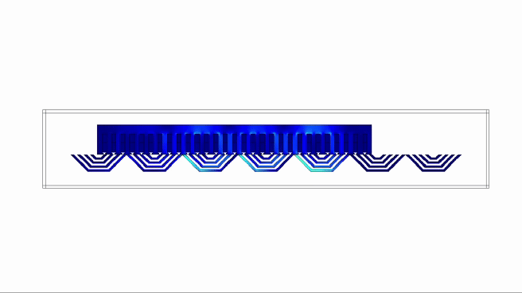

## Designing electrical machines with AI

This project explores the use of machine learning models to capture the physics of electric machines, as well as using them as computationally efficient models for deterministic and evolutionary optimization methods.

By means of supervised learning, we can use simulations obtained via modeling software to train machine learning models, such as neural networks, support vector machines and radial basis functions. The trained models are efficient (very fast to evaluate) and accurate. This makes them ideal for iterative optimization schemes, like sequential quadratic programming, genetic algorithms and bacterial foraging algorithms.

The presented approach should be applicable to the design and optimization of any physical system where physical realizations are too costly, analytical solutions are not tractable or computer simulations are expensive.

This project was developed using MATLAB, COMSOL and the [SUMO toolbox](http://sumo.intec.ugent.be/).

The project's book and slides are written in Spanish.
